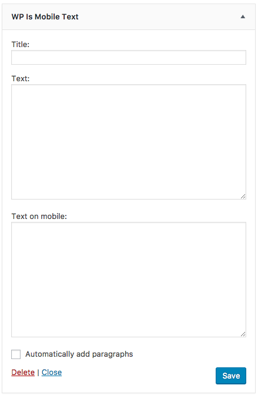

# Introducing WP Is Mobile Text Widget

WP Is Mobile Text Widget plugin adds text widget that switched display text using wp_is_mobile() function whether the device is mobile or not.

## Screenshot

## Installation

1. Download and unzip files. Or install **WP Is Mobile Text Widget** using the WordPress plugin installer. In that case, skip 2.
2. Upload **wp-is-mobile-text-widget** to the "/wp-content/plugins/" directory.
3. Activate the plugin through the 'Plugins' menu in WordPress.
4. Add the **WP Is Mobile Text** widget to a widget area and configure settings through the 'Widgets' menu in WordPress.
5. Have fun!

### Filter Hooks

* [`widget_title`](https://developer.wordpress.org/reference/hooks/widget_title/)
* [`widget_text`](https://developer.wordpress.org/reference/hooks/widget_text/)
* `wp_is_mobile_text_widget_text` - Filters the content of the Text widget when wp_is_mobile is false.
* `wp_is_mobile_text_widget_is_mobile_true` - Filters the content of the Text widget when wp_is_mobile is true.

## WordPress Plugin Directory

WP Is Mobile Text Widget is hosted on the WordPress Plugin Directory.

[https://wordpress.org/plugins/wp-is-mobile-text-widget/](https://wordpress.org/plugins/wp-is-mobile-text-widget/)

## Support

If you have any trouble, you can use the forums or report bugs.

* Forum: [https://wordpress.org/support/plugin/wp-is-mobile-text-widget/](https://wordpress.org/support/plugin/wp-is-mobile-text-widget/)
* Issues: [https://github.com/thingsym/wp-is-mobile-text-widget/issues](https://github.com/thingsym/wp-is-mobile-text-widget/issues)

## Contribution

Small patches and bug reports can be submitted a issue tracker in Github. Forking on Github is another good way. You can send a pull request.

Translating a plugin takes a lot of time, effort, and patience. I really appreciate the hard work from these contributors.

If you have created or updated your own language pack, you can send gettext PO and MO files to author. I can bundle it into plugin.

* [VCS - GitHub](https://github.com/thingsym/wp-is-mobile-text-widget)
* [Homepage - WordPress Plugin](https://wordpress.org/plugins/wp-is-mobile-text-widget/)
* [Translate WP Is Mobile Text Widget into your language.](https://translate.wordpress.org/projects/wp-plugins/wp-is-mobile-text-widget)

You can also contribute by answering issues on the forums.

* Forum: [https://wordpress.org/support/plugin/wp-is-mobile-text-widget/](https://wordpress.org/support/plugin/wp-is-mobile-text-widget/)
* Issues: [https://github.com/thingsym/wp-is-mobile-text-widget/issues](https://github.com/thingsym/wp-is-mobile-text-widget/issues)

### Patches and Bug Fixes

Forking on Github is another good way. You can send a pull request.

1. Fork [WP Is Mobile Text Widget](https://github.com/thingsym/wp-is-mobile-text-widget) from GitHub repository
2. Create a feature branch: git checkout -b my-new-feature
3. Commit your changes: git commit -am 'Add some feature'
4. Push to the branch: git push origin my-new-feature
5. Create new Pull Request

### Contribute guidlines

If you would like to contribute, here are some notes and guidlines.

* All development happens on the **develop** branch, so it is always the most up-to-date
* The **master** branch only contains tagged releases
* If you are going to be submitting a pull request, please submit your pull request to the **develop** branch
* See about [forking](https://help.github.com/articles/fork-a-repo/) and [pull requests](https://help.github.com/articles/using-pull-requests/)

## Test Matrix

For operation compatibility between PHP version and WordPress version, see below [Github Actions](https://github.com/thingsym/wp-is-mobile-text-widget/actions).

## Changelog

* Version 1.2.1
	* tested up to 6.2.0
	* fix composer scripts
	* update github actions
	* fix load_textdomain method for testability
	* add msgmerge to composer scripts
	* add support section and enhance contribution section to README
	* fix license
	* fix wp-plugin-unit-test.yml
* Version 1.2.0
	* fix composer script
	* separate the file structure for class file
	* fix load_textdomain for Widgets Screen
* Version 1.1.3
	* update japanese translation
	* update pot
	* change makepot from php script to wp cli
	* fix constants to uppercase
	* change plugin initialization to plugins_loaded hook
	* replace assert from assertEquals to assertSame
* Version 1.1.2
	* update wp-plugin-unit-test.yml
	* bump up yoast/phpunit-polyfills version
	* change os to ubuntu-20.04 for ci
	* add Upgrade Notice
	* change requires at least to wordpress 4.9
	* change requires to PHP 5.6
* Version 1.1.1
	* add Constants
	* change from protected variable to public variable for unit test
	* update composer dependencies
	* fix composer scripts
	* add timeout-minutes to workflows
	* add phpunit-polyfills
	* tested up to 5.8.0
* Version 1.1.0
	* tested up to 5.7.0
	* add test case
	* disable direct file access
	* add load_textdomain method
	* add sponsor link
	* update japanese translation
	* update pot
	* add FUNDING.yml
	* add donate link
	* update wordpress-test-matrix
	* add GitHub actions for CI/CD, remove .travis.yml
* Version 1.0.5
	* fix indent and reformat with phpcs and phpcbf
	* add composer.json for test
	* add static code analysis config
* Version 1.0.4
	* return noting in case empty text
	* fix $instance value in case none $new_instance
	* fix PHPDoc
	* fix codesniffer.ruleset.xml
	* fix tests
* Version 1.0.3
	* fix label
	* update screenshot
	* fix languages
	* refactoring
	* add PHPDoc comment
	* add filters 'widget_text'
	* add filters 'wp_is_mobile_text_widget_text' and 'wp_is_mobile_text_widget_is_mobile_true'
	* fix tests
	* fix .travis.yml
* Version 1.0.2
	* refactoring
	* add phpunit and tests
* Version 1.0.1
	* clean up source by the PHP_CodeSniffer
* Version 1.0.0
	* initial release

## Upgrade Notice

* Version 1.1.2
	* Requires at least version 4.9 of the WordPress
	* Requires PHP version 5.6
* Version 1.0.3
	* Requires at least version 3.7 of the Wordpress

## License

Licensed under [GPLv2](https://www.gnu.org/licenses/gpl-2.0.html).
